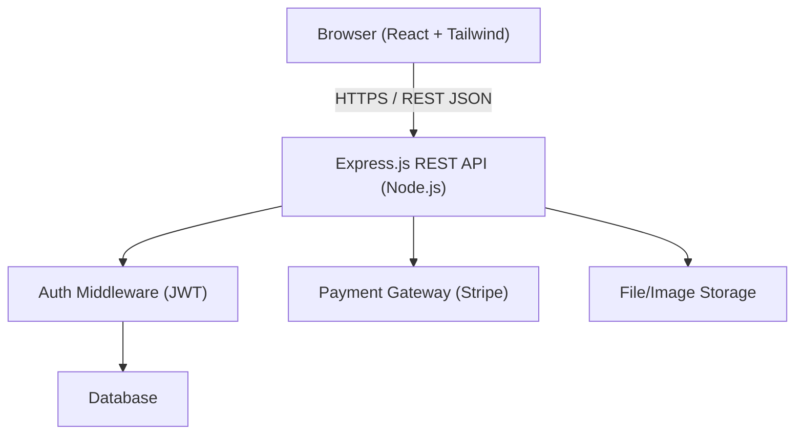
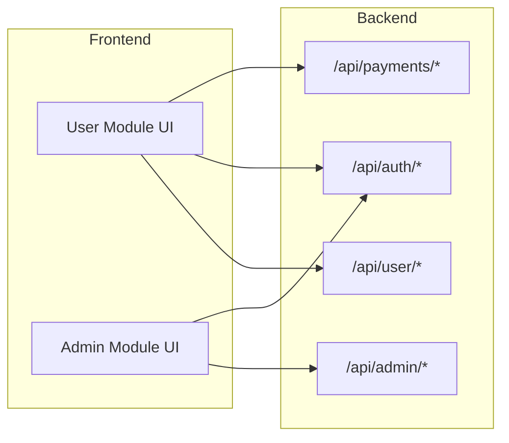
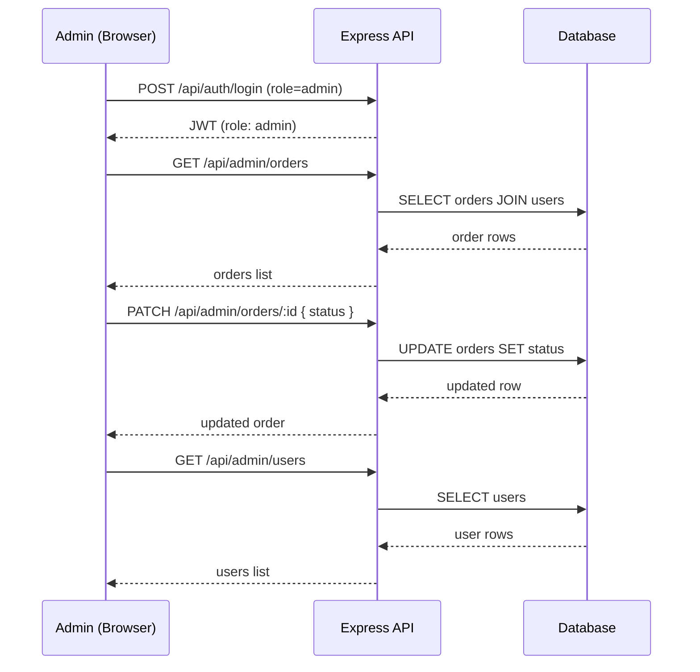

# Design Document: Clothing E-Commerce Website

## Overview

A full-stack clothing e-commerce platform built with React.js + Tailwind CSS on the frontend and Node.js + Express.js on the backend. The system is divided into two primary modules: a **User Module** (browsing, cart, checkout, payments) and an **Admin Module** (order management, user data, inventory). The platform supports secure user authentication, product catalog management, a shopping cart and payment workflow, and an administrative dashboard for managing the business.

The backend exposes a RESTful API consumed by the React frontend. Authentication is handled via JWTs. Payments are processed through a third-party provider (e.g., Stripe). The database schema will be supplied separately as a script.

---

## Architecture



### High-Level Module Separation



---

## Sequence Diagrams

### User Purchase Flow

```mermaid
sequenceDiagram
    participant U as User (Browser)
    participant API as Express API
    participant DB as Database
    participant PG as Payment Gateway

    U->>API: POST /api/auth/login
    API-->>U: JWT token

    U->>API: GET /api/products
    API->>DB: SELECT products
    DB-->>API: product rows
    API-->>U: product list

    U->>API: POST /api/cart/add { productId, qty }
    API->>DB: UPSERT cart_items
    API-->>U: updated cart

    U->>API: POST /api/payments/intent { cartId }
    API->>PG: create payment intent
    PG-->>API: clientSecret
    API-->>U: clientSecret

    U->>PG: confirmPayment(clientSecret)
    PG-->>U: payment confirmed

    U->>API: POST /api/orders { cartId, paymentIntentId }
    API->>DB: INSERT order, order_items; clear cart
    API-->>U: orderId, confirmation
```

### Admin Order Management Flow



---

## Components and Interfaces

### Frontend Components

#### UserModule

**Purpose**: Everything a shopper interacts with — browsing, cart, checkout, account.

**Key Pages/Components**:
- `ProductListPage` — grid of products with filters
- `ProductDetailPage` — single product view, add-to-cart
- `CartDrawer` / `CartPage` — live cart summary
- `CheckoutPage` — address, payment form
- `OrderHistoryPage` — past orders
- `AuthPages` — login / register

#### AdminModule

**Purpose**: Internal dashboard for staff to manage orders, view users, manage inventory.

**Key Pages/Components**:
- `AdminDashboard` — KPIs (revenue, pending orders)
- `OrdersTable` — list, filter, update order status
- `UserManagementTable` — view user profiles and order history
- `ProductManagementPage` — CRUD on products, images, stock

---

### Backend Route Groups

#### Auth Routes — `/api/auth`

```typescript
// POST /api/auth/register
interface RegisterRequest {
  name: string
  email: string
  password: string  // plain text; hashed server-side
}
interface RegisterResponse {
  userId: string
  token: string
}

// POST /api/auth/login
interface LoginRequest {
  email: string
  password: string
}
interface LoginResponse {
  token: string       // JWT
  role: 'user' | 'admin'
  userId: string
}
```

#### Product Routes — `/api/products`

```typescript
// GET /api/products?category=&search=&page=&limit=
interface ProductListResponse {
  products: Product[]
  total: number
  page: number
  limit: number
}

// GET /api/products/:id
// POST /api/admin/products          (admin only)
// PUT  /api/admin/products/:id      (admin only)
// DELETE /api/admin/products/:id    (admin only)
```

#### Cart Routes — `/api/cart`

```typescript
// GET    /api/cart              → CartResponse
// POST   /api/cart/add          { productId: string, quantity: number }
// PATCH  /api/cart/update       { productId: string, quantity: number }
// DELETE /api/cart/remove/:productId
```

#### Order Routes — `/api/orders` / `/api/admin/orders`

```typescript
// POST   /api/orders            { cartId, paymentIntentId, shippingAddress }
// GET    /api/orders            → user's own orders
// GET    /api/orders/:id        → single order detail

// GET    /api/admin/orders      → all orders (admin)
// PATCH  /api/admin/orders/:id  { status: OrderStatus }
```

#### Payment Routes — `/api/payments`

```typescript
// POST /api/payments/intent
interface PaymentIntentRequest {
  cartId: string
}
interface PaymentIntentResponse {
  clientSecret: string
  amount: number      // in cents
  currency: string
}
```

#### User Management Routes — `/api/admin/users`

```typescript
// GET  /api/admin/users         → all users (admin)
// GET  /api/admin/users/:id     → user detail + order history (admin)
```

---

## Data Models

### User

```typescript
interface User {
  id: string            // UUID
  name: string
  email: string         // unique
  passwordHash: string
  role: 'user' | 'admin'
  createdAt: Date
  updatedAt: Date
}
```

**Validation Rules**:
- `email` must be a valid email format and unique
- `password` minimum 8 characters (stored as bcrypt hash)
- `role` defaults to `'user'`

### Product

```typescript
interface Product {
  id: string
  name: string
  description: string
  price: number         // in cents
  stock: number
  category: string
  imageUrl: string
  createdAt: Date
  updatedAt: Date
}
```

**Validation Rules**:
- `price` must be a positive integer (cents)
- `stock` must be >= 0
- `name` must be non-empty

### CartItem

```typescript
interface CartItem {
  cartId: string
  productId: string
  quantity: number      // >= 1
}
```

### Order

```typescript
type OrderStatus = 'pending' | 'confirmed' | 'shipped' | 'delivered' | 'cancelled'

interface Order {
  id: string
  userId: string
  status: OrderStatus
  totalAmount: number   // in cents
  shippingAddress: Address
  paymentIntentId: string
  createdAt: Date
  updatedAt: Date
}

interface OrderItem {
  orderId: string
  productId: string
  quantity: number
  priceAtPurchase: number   // snapshot of price in cents
}

interface Address {
  line1: string
  line2?: string
  city: string
  state: string
  postalCode: string
  country: string
}
```

---

## Key Functions with Formal Specifications

### `register(req, res)`

```typescript
async function register(req: Request, res: Response): Promise<void>
```

**Preconditions:**
- `req.body.email` is a valid, non-empty email string
- `req.body.password` is at least 8 characters
- `req.body.name` is a non-empty string
- No user with `req.body.email` exists in the database

**Postconditions:**
- A new `User` row is inserted with `role = 'user'`
- `passwordHash` is a bcrypt hash of the plain-text password
- A signed JWT is returned to the client
- HTTP 201 response on success; HTTP 409 if email exists; HTTP 422 if validation fails

### `login(req, res)`

```typescript
async function login(req: Request, res: Response): Promise<void>
```

**Preconditions:**
- `req.body.email` and `req.body.password` are non-empty strings

**Postconditions:**
- If credentials match: HTTP 200 with signed JWT containing `{ userId, role }`
- If email not found or password mismatch: HTTP 401 (same message to prevent enumeration)

### `addToCart(req, res)`

```typescript
async function addToCart(req: Request, res: Response): Promise<void>
```

**Preconditions:**
- Request is authenticated (valid JWT)
- `req.body.productId` references an existing product with `stock > 0`
- `req.body.quantity >= 1`

**Postconditions:**
- If item already in cart: quantity is incremented by `req.body.quantity`
- If item not in cart: new `CartItem` row is inserted
- Total quantity in cart for that product does not exceed available `stock`
- HTTP 200 with updated cart

**Loop Invariants**: N/A (single upsert operation)

### `createOrder(req, res)`

```typescript
async function createOrder(req: Request, res: Response): Promise<void>
```

**Preconditions:**
- Request is authenticated
- `req.body.paymentIntentId` corresponds to a confirmed Stripe payment intent
- Cart is non-empty
- All cart items have sufficient stock

**Postconditions:**
- An `Order` row is inserted with `status = 'pending'`
- `OrderItem` rows are inserted with `priceAtPurchase` snapshotted from current product prices
- Stock is decremented for each ordered product
- The user's cart is cleared
- HTTP 201 with `{ orderId }`

**Loop Invariants:**
- For each order item processed: all previously decremented stock values remain consistent; previously inserted `OrderItem` rows are valid

### `updateOrderStatus(req, res)` (Admin)

```typescript
async function updateOrderStatus(req: Request, res: Response): Promise<void>
```

**Preconditions:**
- Caller has `role = 'admin'` (enforced by middleware)
- `req.params.id` references an existing order
- `req.body.status` is a valid `OrderStatus` value

**Postconditions:**
- Order's `status` field is updated
- HTTP 200 with updated order object
- HTTP 404 if order not found; HTTP 403 if caller is not admin

---

## Algorithmic Pseudocode

### User Authentication Algorithm

```pascal
ALGORITHM authenticate(email, password)
  INPUT: email: String, password: String
  OUTPUT: AuthResult (token: String | error: String)

  BEGIN
    user ← database.findUserByEmail(email)

    IF user IS NULL THEN
      RETURN Error("Invalid credentials")
    END IF

    isMatch ← bcrypt.compare(password, user.passwordHash)

    IF NOT isMatch THEN
      RETURN Error("Invalid credentials")
    END IF

    payload ← { userId: user.id, role: user.role, exp: now() + 7 days }
    token ← jwt.sign(payload, SECRET_KEY)

    RETURN Success(token)
  END
```

### Add To Cart Algorithm

```pascal
ALGORITHM addToCart(userId, productId, quantity)
  INPUT: userId: UUID, productId: UUID, quantity: Integer (>= 1)
  OUTPUT: UpdatedCart

  BEGIN
    product ← database.findProductById(productId)

    IF product IS NULL THEN
      RETURN Error("Product not found")
    END IF

    IF product.stock < quantity THEN
      RETURN Error("Insufficient stock")
    END IF

    existingItem ← database.findCartItem(userId, productId)

    IF existingItem IS NOT NULL THEN
      newQty ← existingItem.quantity + quantity
      IF newQty > product.stock THEN
        RETURN Error("Exceeds available stock")
      END IF
      database.updateCartItem(userId, productId, newQty)
    ELSE
      database.insertCartItem(userId, productId, quantity)
    END IF

    updatedCart ← database.getCart(userId)
    RETURN updatedCart
  END
```

### Create Order Algorithm

```pascal
ALGORITHM createOrder(userId, cartId, paymentIntentId, shippingAddress)
  INPUT: userId: UUID, cartId: UUID, paymentIntentId: String, shippingAddress: Address
  OUTPUT: Order

  BEGIN
    // Verify payment is confirmed
    paymentStatus ← stripe.retrievePaymentIntent(paymentIntentId)
    IF paymentStatus.status ≠ "succeeded" THEN
      RETURN Error("Payment not confirmed")
    END IF

    cartItems ← database.getCartItems(cartId)

    IF cartItems IS EMPTY THEN
      RETURN Error("Cart is empty")
    END IF

    // Validate stock and compute total
    total ← 0
    FOR each item IN cartItems DO
      ASSERT all previously validated items remain in stock
      product ← database.findProductById(item.productId)
      IF product.stock < item.quantity THEN
        RETURN Error("Product " + product.name + " out of stock")
      END IF
      total ← total + (product.price × item.quantity)
    END FOR

    // Begin transaction
    BEGIN TRANSACTION
      order ← database.insertOrder({
        userId, totalAmount: total,
        status: "pending",
        shippingAddress, paymentIntentId
      })

      FOR each item IN cartItems DO
        ASSERT order.id is valid
        product ← database.findProductById(item.productId)
        database.insertOrderItem({
          orderId: order.id,
          productId: item.productId,
          quantity: item.quantity,
          priceAtPurchase: product.price
        })
        database.decrementStock(item.productId, item.quantity)
      END FOR

      database.clearCart(cartId)
    COMMIT TRANSACTION

    RETURN order
  END
```

### Admin: List Orders with Filters Algorithm

```pascal
ALGORITHM listOrders(filters, pagination)
  INPUT: filters: { status?: OrderStatus, userId?: UUID, dateFrom?: Date, dateTo?: Date }
         pagination: { page: Integer, limit: Integer }
  OUTPUT: { orders: Order[], total: Integer }

  BEGIN
    query ← buildBaseQuery("SELECT * FROM orders JOIN users ON orders.userId = users.id")

    IF filters.status IS NOT NULL THEN
      query ← query.WHERE("orders.status = ?", filters.status)
    END IF

    IF filters.userId IS NOT NULL THEN
      query ← query.WHERE("orders.userId = ?", filters.userId)
    END IF

    IF filters.dateFrom IS NOT NULL THEN
      query ← query.WHERE("orders.createdAt >= ?", filters.dateFrom)
    END IF

    total ← database.count(query)
    offset ← (pagination.page - 1) × pagination.limit
    orders ← database.execute(query.LIMIT(pagination.limit).OFFSET(offset))

    RETURN { orders, total }
  END
```

---

## Example Usage

### Frontend: Fetch and Display Products

```typescript
// hooks/useProducts.ts
import { useQuery } from '@tanstack/react-query'
import api from '../lib/api'

export function useProducts(filters: ProductFilters) {
  return useQuery({
    queryKey: ['products', filters],
    queryFn: () =>
      api.get<ProductListResponse>('/products', { params: filters }).then(r => r.data),
  })
}

// ProductListPage.tsx
export function ProductListPage() {
  const [filters, setFilters] = useState<ProductFilters>({ page: 1, limit: 20 })
  const { data, isLoading } = useProducts(filters)

  return (
    <div className="grid grid-cols-2 md:grid-cols-4 gap-4 p-6">
      {isLoading && <Spinner />}
      {data?.products.map(p => (
        <ProductCard key={p.id} product={p} />
      ))}
    </div>
  )
}
```

### Backend: Protected Admin Route with Middleware

```typescript
// middleware/auth.ts
export function requireAuth(req: Request, res: Response, next: NextFunction) {
  const token = req.headers.authorization?.split(' ')[1]
  if (!token) return res.status(401).json({ error: 'Unauthorized' })

  try {
    const payload = jwt.verify(token, process.env.JWT_SECRET!) as JWTPayload
    req.user = payload
    next()
  } catch {
    res.status(401).json({ error: 'Invalid token' })
  }
}

export function requireAdmin(req: Request, res: Response, next: NextFunction) {
  if (req.user?.role !== 'admin') {
    return res.status(403).json({ error: 'Forbidden' })
  }
  next()
}

// routes/admin.ts
router.get('/orders', requireAuth, requireAdmin, listOrders)
router.patch('/orders/:id', requireAuth, requireAdmin, updateOrderStatus)
router.get('/users', requireAuth, requireAdmin, listUsers)
```

### Frontend: Checkout with Stripe

```typescript
// CheckoutPage.tsx
import { useStripe, useElements, PaymentElement } from '@stripe/react-stripe-js'

export function CheckoutPage() {
  const stripe = useStripe()
  const elements = useElements()

  async function handleSubmit(e: FormEvent) {
    e.preventDefault()
    if (!stripe || !elements) return

    // 1. Create payment intent on backend
    const { data } = await api.post<PaymentIntentResponse>('/payments/intent', { cartId })

    // 2. Confirm payment via Stripe
    const { error } = await stripe.confirmPayment({
      elements,
      clientSecret: data.clientSecret,
      redirect: 'if_required',
    })

    if (error) {
      setErrorMessage(error.message ?? 'Payment failed')
      return
    }

    // 3. Create order on backend
    await api.post('/orders', {
      cartId,
      paymentIntentId: data.clientSecret.split('_secret')[0],
      shippingAddress,
    })

    navigate('/orders/confirmation')
  }

  return (
    <form onSubmit={handleSubmit} className="max-w-lg mx-auto p-6 space-y-4">
      <PaymentElement />
      <button type="submit" className="w-full bg-black text-white py-3 rounded-lg">
        Place Order
      </button>
    </form>
  )
}
```

---

## Correctness Properties

1. **Authentication Integrity**: For all login requests, a token is returned if and only if the provided email exists and the password matches the stored hash.
2. **Stock Consistency**: For all `addToCart` and `createOrder` operations, the total quantity of a product across all carts and orders never exceeds its available stock.
3. **Price Snapshot Immutability**: For all orders, `priceAtPurchase` on each `OrderItem` reflects the product price at order creation time and is never updated retroactively.
4. **Admin Isolation**: For all routes under `/api/admin/*`, a request with a non-admin JWT must receive HTTP 403; no data mutations are permitted.
5. **Order-Cart Atomicity**: For all successful `createOrder` calls, either all order items are persisted, stock is decremented, and the cart is cleared — or none of these changes occur (transactional guarantee).
6. **Payment Precedes Order**: For all orders, a corresponding Stripe payment intent with `status = "succeeded"` must exist; no order is created without confirmed payment.
7. **Input Validation Coverage**: For all API endpoints, requests with missing or malformed required fields return HTTP 400/422 before any database operation is performed.

---

## Error Handling

### Scenario 1: Payment Failure

**Condition**: Stripe payment confirmation fails (insufficient funds, card declined)
**Response**: Frontend displays Stripe's error message; no order is created; cart is preserved
**Recovery**: User can retry with a different payment method

### Scenario 2: Stock Sold Out Between Cart and Checkout

**Condition**: A product's stock drops to 0 after it was added to cart but before order creation
**Response**: HTTP 409 from `POST /api/orders`; frontend shows "Item no longer available" message
**Recovery**: User is prompted to remove the unavailable item from cart and continue

### Scenario 3: Invalid or Expired JWT

**Condition**: Request is made with an expired or tampered JWT
**Response**: HTTP 401 from `requireAuth` middleware
**Recovery**: Frontend detects 401, clears local token, redirects to `/login`

### Scenario 4: Admin Accesses User-Only Data

**Condition**: Admin attempts to access endpoints not designated for admins
**Response**: Shared auth middleware — admins are also valid users and can browse the store
**Note**: Admin routes are behind `requireAdmin`; user routes only check `requireAuth`

### Scenario 5: Database Transaction Failure

**Condition**: A step inside `createOrder` transaction fails (e.g., constraint violation)
**Response**: Full transaction rollback; HTTP 500 returned with a generic message; error logged server-side
**Recovery**: User is notified to retry; payment intent may need to be voided via Stripe webhook

---

## Testing Strategy

### Unit Testing

- **Framework**: Jest (backend), Vitest (frontend)
- Test individual route handlers with mocked database and Stripe client
- Test middleware (`requireAuth`, `requireAdmin`) in isolation
- Test utility functions: price calculation, JWT generation/verification, bcrypt helpers

### Property-Based Testing

- **Library**: fast-check
- Properties to test:
  - Cart quantity never exceeds product stock for any valid sequence of add/update operations
  - Order total always equals the sum of `(priceAtPurchase × quantity)` for all order items
  - JWT generation/verification roundtrips: `verify(sign(payload)) === payload` for all valid payloads
  - Pagination: for any page/limit combination, `results.length <= limit` always holds

### Integration Testing

- Test full request-response cycles against a real (test) database
- Cover the complete checkout flow: register → browse → add to cart → payment intent → create order
- Cover admin flows: login as admin → view orders → update status

---

## Performance Considerations

- Product listing queries should use database indexes on `category`, `createdAt`, and `stock`
- Cart operations should be keyed by `(userId, productId)` with a composite index
- Use React Query for frontend data caching and stale-while-revalidate patterns
- Paginate all list endpoints (default `limit: 20`, max `limit: 100`)
- Image assets should be served from a CDN (e.g., Cloudflare, S3 + CloudFront)

---

## Security Considerations

- Passwords stored as bcrypt hashes with a work factor of 12
- JWTs signed with HS256 and a secure random secret; expire after 7 days
- All admin routes protected by both `requireAuth` and `requireAdmin` middleware
- Stripe secret key never exposed to the frontend; payment intents created server-side
- Input sanitization on all user-supplied fields to prevent SQL injection and XSS
- CORS configured to allow only the frontend origin in production
- Rate limiting on `/api/auth/*` endpoints to mitigate brute-force attacks

---

## Dependencies

### Frontend

| Package | Purpose |
|---|---|
| `react` + `react-dom` | UI framework |
| `tailwindcss` | Utility-first CSS |
| `react-router-dom` | Client-side routing |
| `@tanstack/react-query` | Server state management |
| `axios` | HTTP client |
| `@stripe/stripe-js` + `@stripe/react-stripe-js` | Stripe payment UI |
| `zustand` | Lightweight client state (cart, auth) |

### Backend

| Package | Purpose |
|---|---|
| `express` | HTTP server framework |
| `jsonwebtoken` | JWT sign/verify |
| `bcryptjs` | Password hashing |
| `stripe` | Stripe SDK |
| `zod` | Request validation schemas |
| `cors` | CORS middleware |
| `express-rate-limit` | Rate limiting |
| `dotenv` | Environment variable loading |
